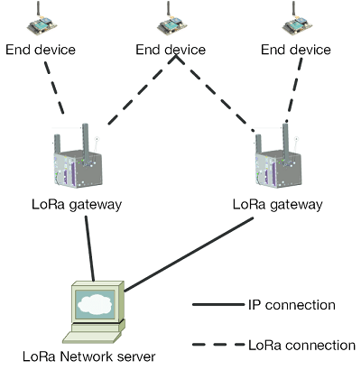

## Why use LoRaWAN ?

- Our *Smart Irrigation Controller* requires an active internet connection at all times to communicate with our main server, and receive updates. 
- We intend to deploy our *Smart Irrigation Controller* on agricultural fields which may span several acres. Usual wireless solutions to connect to the internet like Wi-Fi and Bluetooth are not viable due to their limited range.
- A possible wireless solution would be LoRaWAN (i.e. Long Range Radio Wide Area Network).

---

## LoRaWAN Overview

- LoRaWAN is a wireless solution which allows sending data at extremely low data-rates to extremely long ranges.
- It is a Low Power Wide Area Network (LPWAN) specification, which also offers secure bi-directional communication, mobility and localization services.

- LoRaWAN network architecture :
  - LoRaWAN end-devices connect to a LoRaWAN equipped gateway.
  
  - The gateway is connected to the internet, and can contact the back-end server through a standard IP connection, allowing end-devices and the back-end to communicate.
  
    

---

## Popular LoRaWAN modules

- LoRaWAN 868MHz

| Frequency | TX Power | Sensivity | Range (Rural) | Range (Urban) | Radio Bit-rate |
| -----| ------ | -----| ------| -------| -----|
| 868 MHz | +14dbm | -136 dBm | 15km | 5km | 250 to 5470 bps |

| State | Power Consumption |
|-------- | ----- |
| Idle | 2.8 mA at 3.3v |
| Transmitting data | 38.9 mA at 3.3v |
| Receiving data | 14.2 mA at 3.3v |

- LoRaWAN 900MHz

| Frequency | TX Power | Sensivity | Range (Rural) | Range (Urban) | Radio Bit-rate |
| -----| ------ | -----| ------| -------| -----|
| 900 MHz | +18.5dbm | -136 dBm | 15km | 5km | 250 to 12500 bps |

| State | Power Consumption |
|-------- | ---- |
| Idle | 2.7 mA at 3.3v |
| Transmitting data | 124.4 mA at 3.3v |
| Receiving data | 13.5 mA at 3.3v |

---

## What's the difference between LoRaWAN & LoRA ?

- **LoRa** contains only the link layer protocol, and works in the 868 and 900MHz bands

  - LoRa offers satisfying performance if we only want to connect two nodes through P2P.

- **LoRaWAN** includes both the link layer protocol and the network layer protocol, and works in the 868/900/433MHz bands

  - LoRaWAN is not advised for projects which require real-time streaming, or which cannot support any type of packet delay. Transmission is not done in real time as there is a minimum delay for packet arrival (around 1 to 5 seconds depending on range/LoRaWAN module).

  - With LoRaWAN, we can deploy private LoRaWAN networks using LoRaWAN-compatible base stations and gateways.

    

---

## Connecting to the Raspberry-Pi

- Raspberry-Pi boards can communicate with the LoRaWAN module over UART.
- The LoRaWAN library is available for the Raspberry-Pi [here](https://www.cooking-hacks.com/media/cooking/images/documentation/tutorial_kit_lorawan/arduPi_api_LoRaWAN_v1_3.zip). It requires the ArduPi library, which is downloadable [here](https://www.cooking-hacks.com/media/cooking/images/documentation/raspberry_arduino_shield/raspberrypi2.zip).
- *ArduPi* is a C++ library that lets you write programs for Raspberry Pi as if you  were writing an Arduino program. All the functions in order to control Serial port communications,  i2C, SPI and GPIO pins are available using the Arduino syntax.

---

## Source

- [Cooking hacks,LoRaWAN Technology for Raspberry Pi](https://www.cooking-hacks.com/documentation/tutorials/lorawan-for-arduino-raspberry-pi-waspmote-868-900-915-433-mhz.html)

