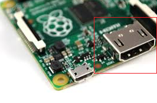
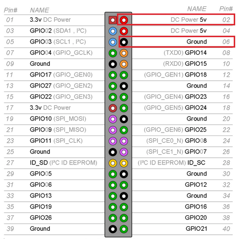

# Official Power Recommendations

The Raspberry-Pi can be powered in two ways :  

- **(1)** Through its Micro-USB port, with a recommended input voltage of 5V input current of 2A.

- **(2)** Through it's GPIO interface by plugging a 5V source to Pin #2 on the GPIO header, and the ground of this 5V source to Pin #6 on the GPIO header.

- **Warning** : The recommended method of powering the Raspberry-Pi is through its Micro-USB port, as it offers regulation and fuse protection to protect from over-voltage and current spikes. **There is no regulation and fuse protection on the GPIO Interface** meaning that any over-voltage, current spikes, or reverse polarization might fry the GPIO interface, or worse, the Pi itself.

  

# Power Consumption Benchmarks

We know that the Raspberry-Pi requires an input voltage of 5V. We will now see how much current (and coincidentally power) the Raspberry-Pi draws under different load conditions. All the benchmarks will be taken from the [PidRamble](https://www.pidramble.com/wiki/benchmarks/power-consumption) website. The boards are running stock Raspbian Lite, with no additional software installed and only running basic daemons. There are no additional peripherials connected to the Pi boards.

| Raspberry-Pi Model | Pi State | Power Consumption |
| ---------------------------- | ----------------| -------------|
| Raspberry-Pi 3 B+ | Idle | 350 mA (1.9 W) |
| Raspberry-Pi 3 B+ | Maximum CPU Load | 980 mA (5.1 W) |
| Raspberry-Pi 3 B+ | Minimal CPU Load with HDMI & LEDs disabled | 350 mA (1.7 W) |
| Raspberry-Pi 3 B | Idle | 260 mA (1.4 W) |
| Raspberry-Pi 3 B | Maximum CPU Load | 730 mA (3.7 W) |
| Raspberry-Pi 3 B | Minimal CPU Load with HDMI & LEDs disabled | 230 mA (1.2 W) |
| Raspberry-Pi 2 B | Idle | 220 mA (1.1 W) |
| Raspberry-Pi 2 B | Maximum CPU Load | 400 mA (2.1 W) |
| Raspberry-Pi 2 B | Minimal CPU Load with HDMI & LEDs disabled | 200 mA (1.0 W) |
| Raspberry-Pi Zero | Idle |  80 mA (0.4 W) |
| Raspberry-Pi Zero | Maximum CPU Load | 240 mA (1.2 W) |
| Raspberry-Pi Zero | Minimal CPU Load | 40 mA (0.2 W) |

**Note** : All Raspberry-Pi models consume around 0.1W when powered off, until they are disconnected from their power source.

# Source

- [PiHut - How do I power my Raspberry Pi?](https://thepihut.com/blogs/raspberry-pi-tutorials/how-do-i-power-my-raspberry-pi)