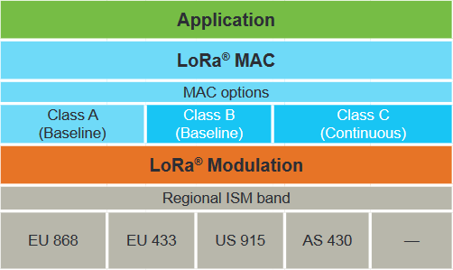
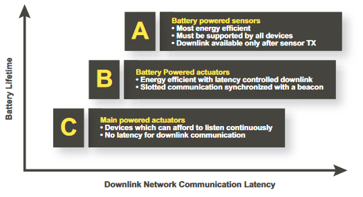

**Disclaimer** : This page gives an overview of the LoRa and LoRaWAN technology. Most of the information here comes from the [Official LoRa Alliance](https://lora-alliance.org/sites/default/files/2018-04/what-is-lorawan.pdf) website.

# What is LoRa ?

- LoRa is a technology providing the wireless modulation/physical layer used to create a long range communication link. It is based on chirp-spread spectrum modulation.

- LoRa is a LPWAN (i.e. Low Power Wide Area) technology, mainly used with IoT devices. Compared to other Cellular Networks standards (i.e. GSM, 3G, 4G...) and LAN standards (i.e. Wi-Fi and Bluetooth), it is a relatively new standard and does not support high data rates, however it offers low power consumption and can function at longer ranges (i.e. more than 1KM).
- LoRa wireless modulation respects regional standards, and can be set-up to operate in the appropriate ISM bands (EU 868, EU 433, US 915, AS 430...). Lebanese laws allow us to operate in the EU868 and EU 433 bands. For more information on identifying the appropriate channels per country, please see [this document](https://link.springer.com/content/pdf/bbm%3A978-1-4842-4357-2%2F1.pdf). 

# What is LoRaWAN ?

- As mentioned previously, LoRa defines the wireless modulation used, and enables long-range communication links. The LoRaWAN standard is built on top of LoRa, and defines the communication protocol and system architecture of the network. LoRaWAN gateways, or base stations, are deployed to receive data from LoRa modules and can cover large zones (i.e. hundreds of square kilometres) depending on the area. 

  

### Network Architecture

- A simple architecture is recommended for LoRaWAN networks. Having a complex network may risk straining network capacity or reduce battery life of autonomous LoRaWAN network nodes. 
- LoRaWAN network nodes are not associated with a specific gateway, instead we should expect each node to transmit to all gateways in proximity. Each gateway will forward the received packet to the cloud based network server, which will filter redundant packet and schedule acknowledgments for received packets.
- LoRaWAN nodes follow the Aloha protocol. It means that each nodes are asynchronous and communicate when they have data ready to sent, which can be either event-driven or scheduled. Not needing each node to "wake-up" to synchronize with the network and check for messages (like in mobile networks for example), allows us to be more battery-efficient.

### Network Capacity

- LoRaWAN allows for high network capacity by utilizing adaptive data rate and multichannel multi-mode transceiver in the gateway, so that simultaneous messages can be received on multiple channels. A network can be deployed with a minimal amount of infrastructure, and as capacity is needed, more gateways can be added, shifting up the data rates, reducing the amount of overhearing to other gateways, and scaling the capacity by 6-8x.
- The ISM band at which the LoRaWAN network operates dictates the maximum data-rate and amount of simultaneous channels. For example, ISM band EU-686 allows for 10 channels and up-to 50kbps data rate, and ISM band US-915 allows for 64 channels and up-to 22kbps data rate.

### Network Security

- LoRaWAN uses two layers of security : one for the network and one for the application. The network security ensures authenticity of the node in the network while the application layer of security ensures the network operator does not have access to the end user's application data. AES encryption is used with the key exchange utilizing an IEEE EUI64 identifier.

### Device Classes

- LoRaWAN uses different device classes to serve different types of end-devices, each with trade-offs related to battery lifetime and downlink communication latency.

# Source

- [LoRa-Alliance Official Documentation](https://lora-alliance.org/sites/default/files/2018-04/what-is-lorawan.pdf)